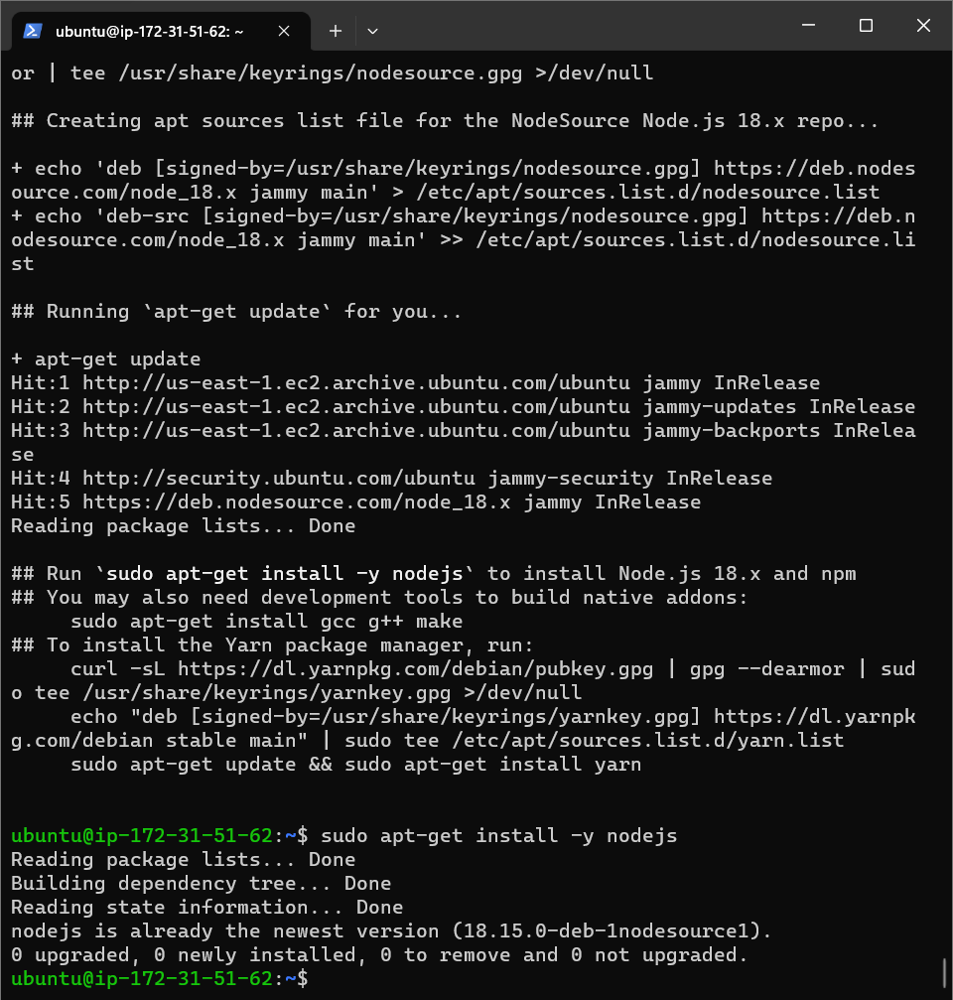
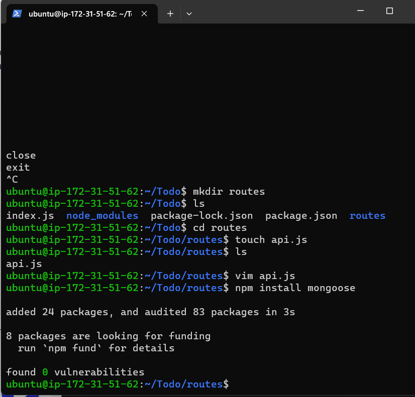
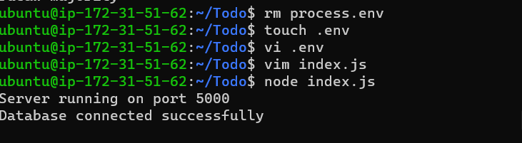

# Awesome documentation of project 3: MERN Stack Implementation.

### Step1: Installation of the Node.js Web Server 
#### Node.js is a high-performance web server and i used the apt package manager to install this package.The cmd used is the "sudo apt -get install -y nodejs"

 

### Step 2: installation of expressjs was done successfully.

#### ExpressJs is a server side web application which is also a framework that is been used by node.js to perform its operations. In mern stack ExpressJs is been installed also in order to get optimum functionality.

##### I have also created a folder called 'Todo', this is where my npm project would be stored.

 

### Step3: Installation of MongoDB Database

#### Here am using the cmd 'npm install mongoose' which was done successfully. After that i created a folder called models here is where my todo.js file was stored and for easy reference.

 

 #### Step 4: MongoDb configuration using the mlab. this provides mongoDB database as a service solution. i signed up on the mlab and created a cluster which after i created a database for my project.
##### After the connection string have been configured we then test our project by running the cmd "node index.js" which would test if the database is connected succsessfully.
 

#### Step 5: Frontend Creation was where i started building my user interface. This section deals with the whole look and feel of the application and it it was the users see.  to get get started i ran a "npx create-react-app client" cmd we going to be using a React application that cmd would create a folder called client where all our front end codes would be stored. then the cmd "npm install concurrently --save-dev" was used to un my servers concurrently. 

